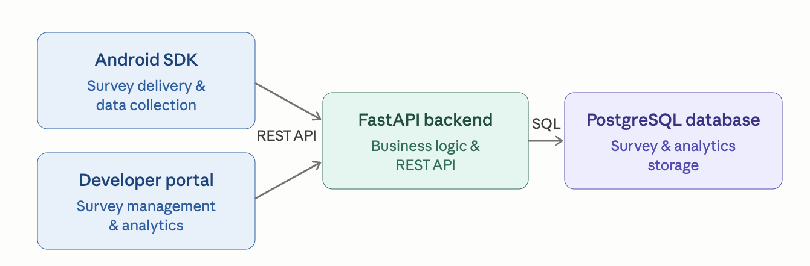

# 📊 GeoSurvey - Mobile Survey & Analytics Platform

GeoSurvey is a full-stack survey and analytics platform developed as part of the Mobile Technologies Seminar at Afeka College of Engineering.

The platform enables developers to integrate interactive surveys into Android applications, collect user responses and geographic data, and analyze results through a dedicated web portal.

---

## ✨ Key Features

- **Android SDK** – Drop-in Kotlin library that any Android app can embed to display surveys as a native dialog
- **Developer Portal** – React SPA for creating surveys, managing their lifecycle (draft → active → done), and viewing analytics
- **Geographic Analytics** – Android Geocoder reverse-geocodes GPS coordinates to Israeli districts (North, South, Center, Jerusalem); the backend normalizes and aggregates responses by region
- **Engagement Tracking** – Every survey open, completion, and abandonment is logged; a pre-computed summary table keeps dashboard queries fast
- **Offline-First SDK** – Responses are persisted to SharedPreferences before network submission; pending responses are retried automatically when the next survey dialog is opened
- **Multi-tenant** – Each developer account sees only their own surveys

---

## 🛠️ Technologies Used

| Layer | Technology | Minimum Version |
|-------|------------|----------------|
| Mobile SDK | Kotlin | — |
| Backend | FastAPI | 0.136 |
| Database | PostgreSQL | 14 |
| ORM | SQLAlchemy | 2.0 |
| Frontend | React + Vite | 19 / 8 |
| Python | — | 3.10 |
| Node.js | — | 18 |
| Android API | — | 26 (Android 8.0) |

---

## 🔄 System Flow

1. A developer creates a survey in the portal and sets it to `active`.
2. A mobile app first calls `SurveySdk.initialize(baseUrl, enableLocation)`, then calls `SurveySdk.showSurvey(context, surveyId)`.
3. The SDK fetches the survey, shows a native dialog, and optionally requests GPS permission.
4. On completion, the SDK submits answers (tagged with the user's Israeli district) and an engagement event to the backend.
5. The developer views updated analytics on the portal dashboard.

---

## 🏗️ System Architecture

The GeoSurvey platform consists of four main components:

- Android SDK for survey delivery and response collection.
- React Developer Portal for survey management and analytics visualization.
- FastAPI Backend that exposes REST APIs and handles business logic.
- PostgreSQL Database for persistent storage and analytics data.



---

## 🗄️ Database ERD

The ERD below describes the seven tables: `developers`, `surveys`, `questions`, `survey_options`, `responses`, `engagement_events`, and `survey_analytics_summary`.


---

## 📁 Project Structure

```
GeoSurveyProject/
├── backend/
│   ├── main.py                  # All API endpoints
│   ├── models.py                # SQLAlchemy ORM models
│   ├── schemas.py               # Pydantic request/response schemas
│   ├── database.py              # PostgreSQL connection & session factory
│   ├── requirements.txt
│   └── seed_data/
│       ├── seed_election_demo_data.py   # Demo data for election survey
│       └── seed_news_demo_data.py       # Demo data for news survey
│
├── portal/
│   ├── src/
│   │   ├── App.jsx              # Main dashboard + all analytics UI
│   │   ├── config.js            # API base URL (reads VITE_API_URL)
│   │   └── components/
│   │       ├── LoginPage.jsx
│   │       ├── RegisterPage.jsx
│   │       ├── CreateSurveyModal.jsx
│   │       └── EditSurveyModal.jsx
│   ├── package.json
│   └── vite.config.js
│
├── android-sdk/
│   ├── app/                              # Demo application
│   │   └── .../geosurveydemo/
│   │       └── MainActivity.kt
│   └── geosurvey-sdk/                    # SDK library module
│       └── .../geosurvey_sdk/
│           ├── SurveySdk.kt              # Public API singleton
│           ├── ui/SurveyDialog.kt        # Native survey dialog
│           ├── network/
│           │   ├── RetrofitClient.kt
│           │   └── SurveyApi.kt
│           ├── location/GeoSurveyLocationManager.kt
│           ├── storage/LocalResponseStorage.kt
│           └── model/                    # DTOs
│
└── database/
    └── SQL files/create_tables.sql       # PostgreSQL DDL
```

---

## ⚙️ Backend Setup

### 📋 Prerequisites
- Python 3.10+
- PostgreSQL 14+ running locally

### 📦 Install Dependencies

```bash
cd backend

python3 -m venv venv
source venv/bin/activate

pip install -r requirements.txt
```

### 🔐 Configure Environment

Create `backend/.env`:

```
DATABASE_URL=postgresql://<user>:<password>@localhost:5432/geosurvey
```

### 🗄️ Create Database and Tables

Create the database:

```bash
psql -U postgres -c "CREATE DATABASE geosurvey;"
```

Then run the DDL to create all tables:

```bash
psql -U postgres -d geosurvey -f "database/SQL files/create_tables.sql"
```

### 🚀 Run the Server

```bash
uvicorn main:app --reload --host 0.0.0.0 --port 8000
```

API available at `http://localhost:8000`. Interactive docs at `http://localhost:8000/docs`.

---

## 🌐 Portal Setup

### 📋 Prerequisites
- Node.js 18+

### 📦 Install and Run

```bash
cd portal
npm install
npm run dev
```

Portal runs at `http://localhost:5173`.

### 🔗 Configure API URL

Create `portal/.env`:

```
VITE_API_URL=http://localhost:8000
```

> **Note:** The backend CORS policy allows requests only from `http://localhost:5173` and `http://127.0.0.1:5173`. Do not change the portal port without also updating the `origins` list in `backend/main.py`.

---

## 📱 Android SDK Setup

### 🤖 Emulator

`android-sdk/local.properties` is not tracked by git - create it manually if it doesn't exist. Set:

```
GEOSURVEY_BASE_URL=http://10.0.2.2:8000/
```

The Android emulator routes `10.0.2.2` to the host machine's localhost.

### 📲 Physical Device

Find your machine's local IP:

```bash
# Wi-Fi
ipconfig getifaddr en0

# Ethernet
ipconfig getifaddr en1
```

Then set in `local.properties`:

```
GEOSURVEY_BASE_URL=http://<your-local-ip>:8000/
```

Make sure your device and machine are on the same Wi-Fi network.

### 🎯 Survey ID

`MainActivity.kt` is hardcoded to `surveyId = 12` for the demo. Change this to any active survey ID in your database.

### 🔧 Integrating the SDK into Your Own App

**Minimum Android API level:** 26 (Android 8.0)

**Add to your `AndroidManifest.xml`:**

```xml
<uses-permission android:name="android.permission.INTERNET" />
<!-- Required only if enableLocation = true -->
<uses-permission android:name="android.permission.ACCESS_FINE_LOCATION" />
<uses-permission android:name="android.permission.ACCESS_COARSE_LOCATION" />
```

The SDK requests the location runtime permission from the user automatically when the survey dialog opens.

**Initialize and show a survey:**

```kotlin
// Call once, before showSurvey — typically in Application.onCreate() or Activity.onCreate()
SurveySdk.initialize(
    baseUrl = "http://10.0.2.2:8000/",
    enableLocation = true   // false = no location prompt, region will be null
)

// Replace surveyId with the ID of an active survey from your database
SurveySdk.showSurvey(context = this, surveyId = 12)
```

**Dependency:** Include the `geosurvey-sdk` Gradle module in your project (no Maven/JitPack publishing currently — use a local module dependency).

**Offline behavior:** If the network is unavailable when a survey is completed, responses are saved to SharedPreferences and submitted automatically the next time a survey dialog is opened.

---

## 🧪 Seed Data (Demo Surveys)

The seed scripts populate demo data for surveys with IDs **12** and **13**. These surveys must already exist in the database with `status = 'active'` before running the scripts.

### 🗳️ Election Survey

Generates 120 simulated responses with regional weighting across Israeli districts.

```bash
cd backend
python seed_data/seed_election_demo_data.py
```

### 📰 News Survey

Generates engagement events and response counts for a single-question news preference survey.

```bash
cd backend
python seed_data/seed_news_demo_data.py
```

---

## 🔌 Main API Endpoints

| Method | Endpoint | Description |
|--------|----------|-------------|
| POST | `/developers/register` | Register a new developer account |
| POST | `/developers/login` | Authenticate a developer |
| POST | `/surveys` | Create a new survey |
| GET | `/surveys?developer_id={id}` | List surveys for a developer |
| GET | `/surveys/{survey_id}` | Fetch survey details (used by SDK) |
| PUT | `/surveys/{survey_id}` | Update survey title or status |
| PUT | `/surveys/{survey_id}/publish` | Publish a survey (set status to `active`) |
| DELETE | `/surveys/{survey_id}` | Mark a survey as done |
| POST | `/responses/batch` | Submit survey responses |
| POST | `/engagement-events` | Log a survey engagement event |
| GET | `/analytics/surveys/{survey_id}/dashboard` | Full dashboard analytics |
| GET | `/analytics/results/{survey_id}` | Answer distribution by option |
| GET | `/analytics/regions/{survey_id}` | Response breakdown by region |
| GET | `/analytics/engagement/{survey_id}` | Engagement metrics |

---

## ⚡ Server & Analytics Optimization

To improve dashboard performance, the system uses a dedicated analytics summary table:

`survey_analytics_summary`

Instead of recalculating all engagement metrics from raw response and event rows every time the dashboard is opened, the backend stores pre-calculated counters. The summary is updated atomically on every `POST /responses/batch` and `POST /engagement-events` request via `get_or_create_summary()`.

Stored metrics:

- Opened Count
- Completed Count
- Abandoned Count
- Total Responses

Benefits:

- Faster dashboard loading
- Reduced database workload
- Better scalability

---

## 🔐 Authentication & Security

Developer passwords are hashed using bcrypt before being stored in the database.

The backend verifies the password hash during login and never stores plain-text passwords.

---

## 📸 Screenshots

### 🔑 Login Page


### 👤 Register Page


### 📝 Create Survey


### 📊 Analytics Dashboard


### 📱 Android SDK Survey


---

## 🎥 Demo Video

[](https://youtu.be/M8tVrw0B7IY)


