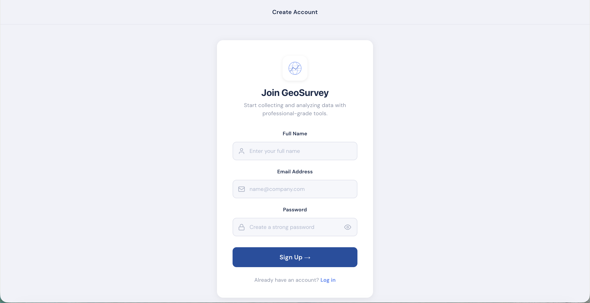
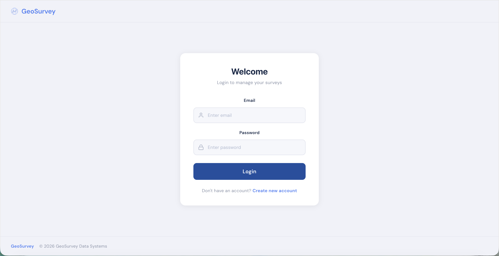
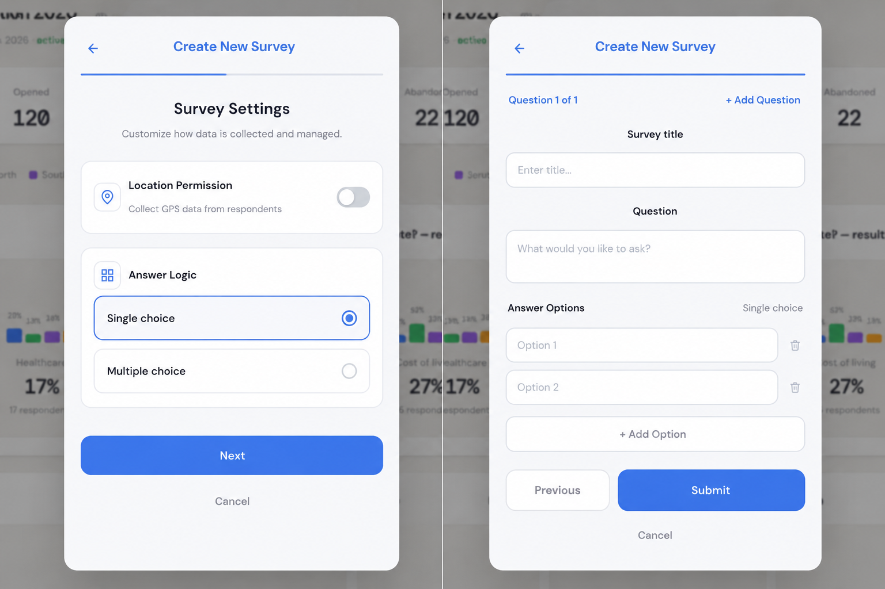
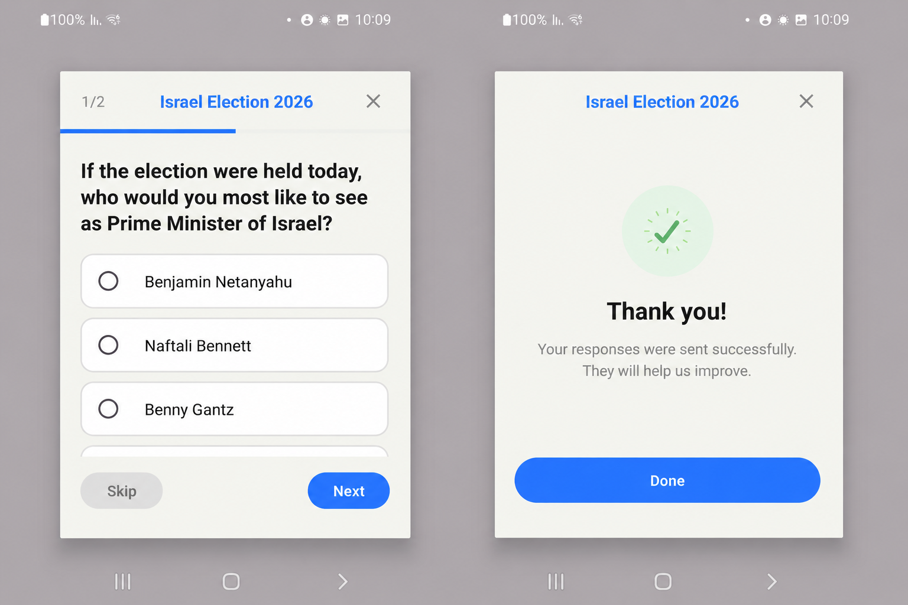
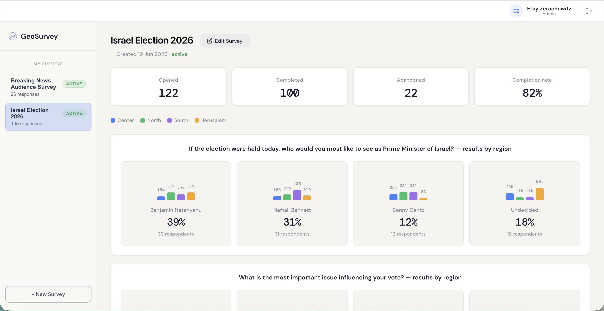

# Screenshots

This page presents the main user interfaces of the GeoSurvey platform and demonstrates the complete survey lifecycle from survey creation to analytics visualization.

## 1. Developer Registration

Developers can create an account and gain access to the GeoSurvey platform.

The registration process allows new developers to onboard and start managing surveys through the Developer Portal.

## 2. Developer Login

Registered developers can securely authenticate and access the platform.

The login page provides access to survey management, analytics dashboards, and platform configuration.

## 3. Survey Creation

The Developer Portal enables developers to create and publish surveys.

Supported capabilities include:

- Single-choice questions
- Multiple-choice questions
- Optional location collection
- Survey publishing workflow

Developers can configure survey content and control whether geographic analytics will be collected.

## 4. Android SDK Survey

The GeoSurvey SDK displays surveys directly inside Android applications.

Key features include:

- Progress tracking
- Question navigation
- Single-choice questions
- Multiple-choice questions
- Optional location collection

The survey dialog is rendered natively within the host Android application using the GeoSurvey SDK.

## 5. Analytics Dashboard

The Developer Portal provides real-time analytics and engagement insights.

Available analytics include:

- Opened surveys
- Completed surveys
- Abandoned surveys
- Completion rate
- Regional analytics
- Question analytics

These metrics help developers evaluate survey effectiveness and understand user behavior.

## Complete User Journey

| Step | Description |
|--------|--------|
| 1 | Developer registers to the platform |
| 2 | Developer logs into the Developer Portal |
| 3 | Developer creates a survey |
| 4 | Survey is published and becomes available |
| 5 | Android SDK retrieves the survey from the backend |
| 6 | User completes and submits responses |
| 7 | Responses and engagement events are stored |
| 8 | Analytics dashboard displays updated results |

## Summary

The screenshots above demonstrate the complete GeoSurvey workflow, including developer onboarding, survey creation, survey delivery through the Android SDK, response collection, and analytics visualization.